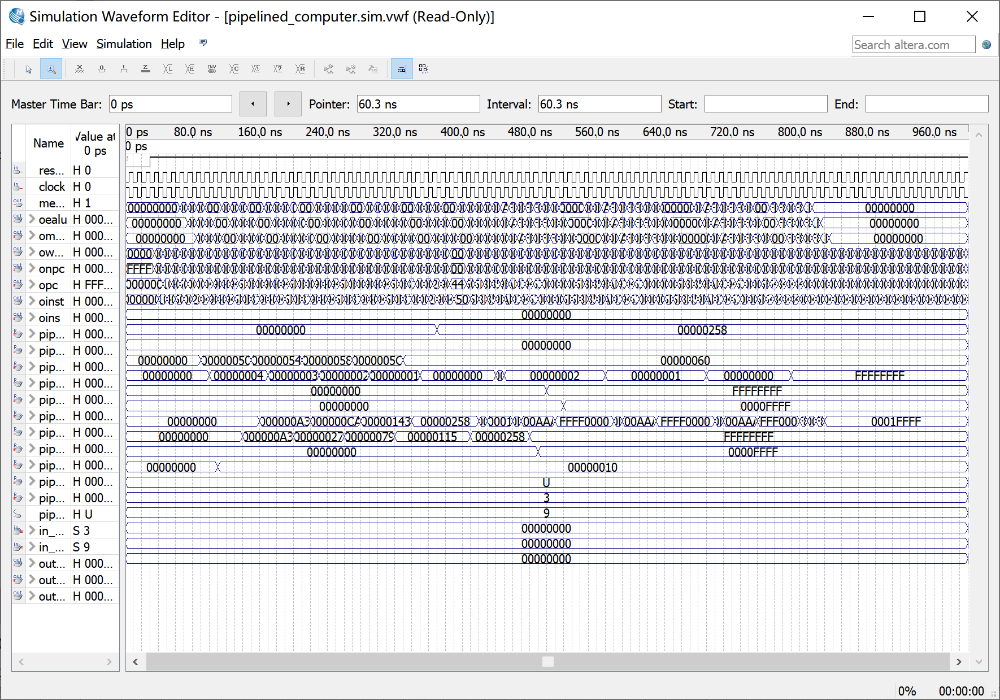
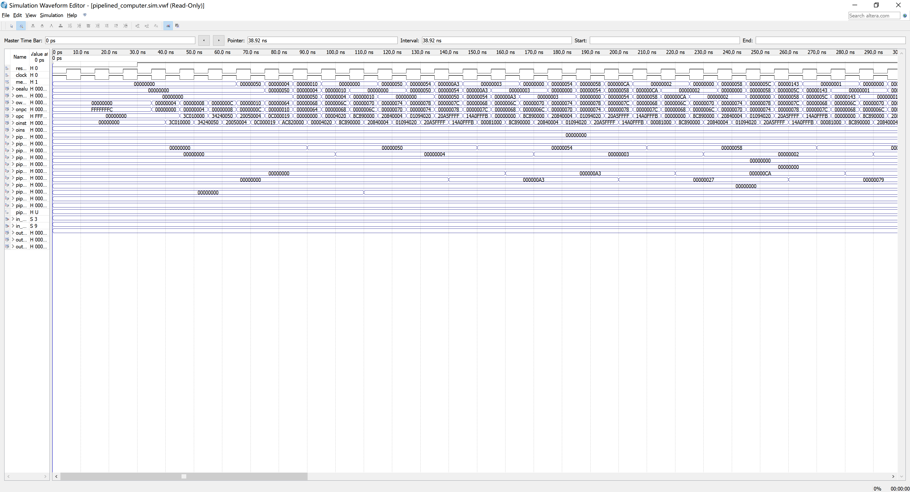
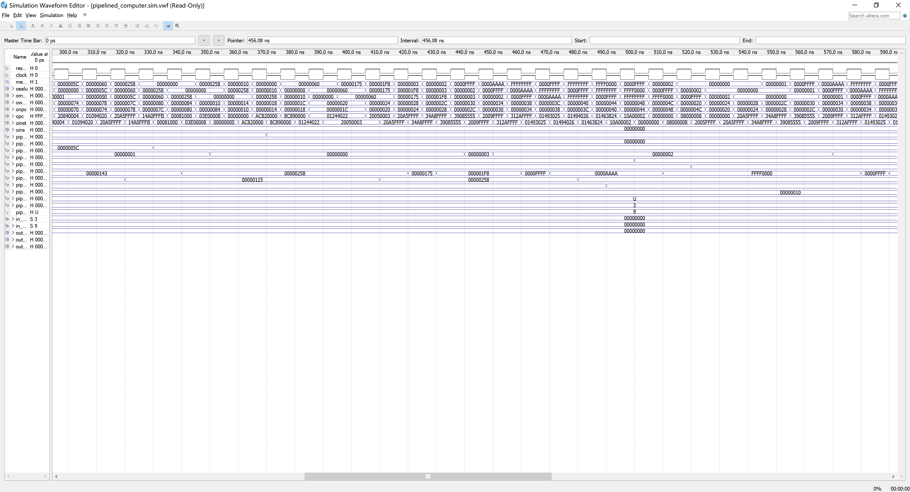
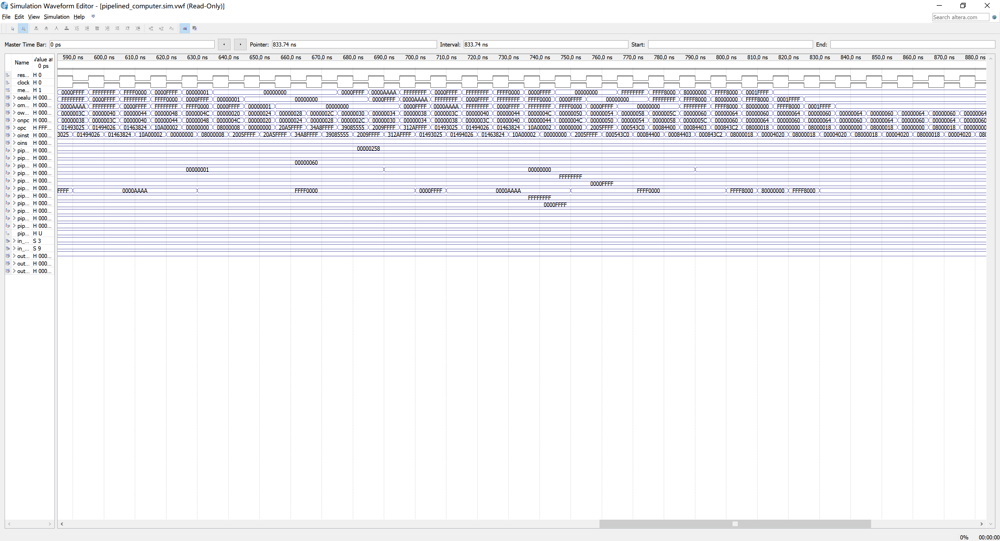
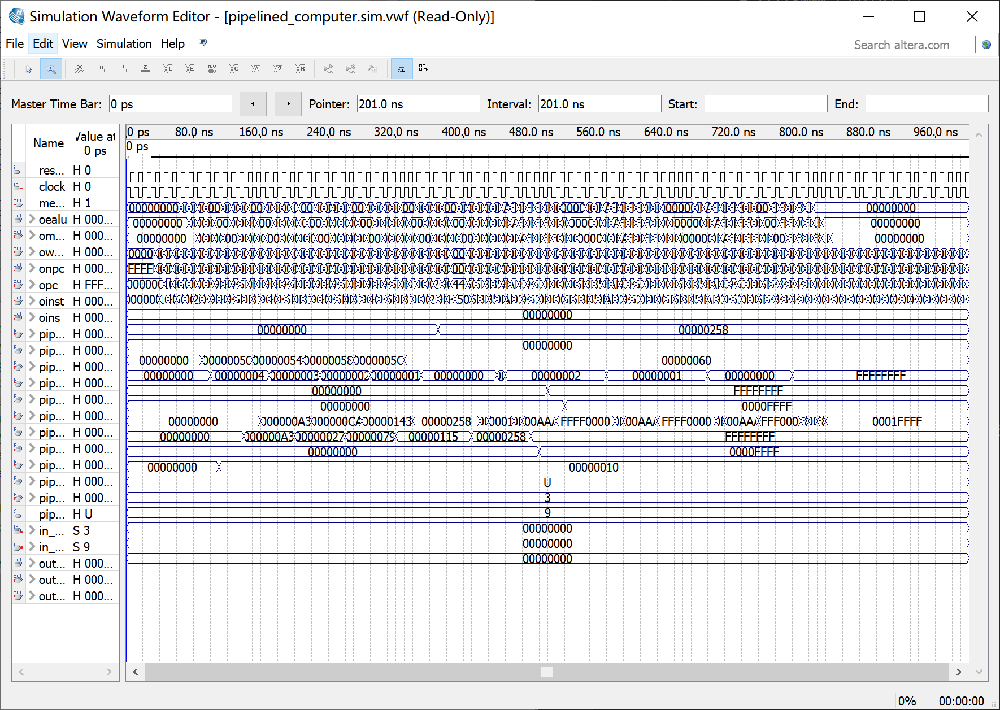
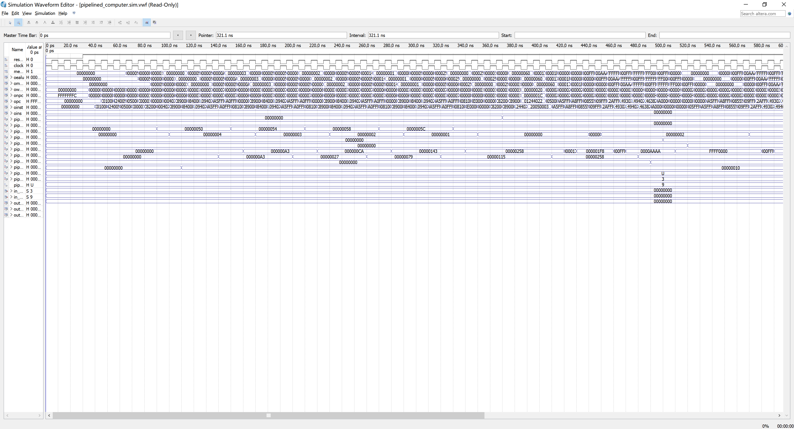
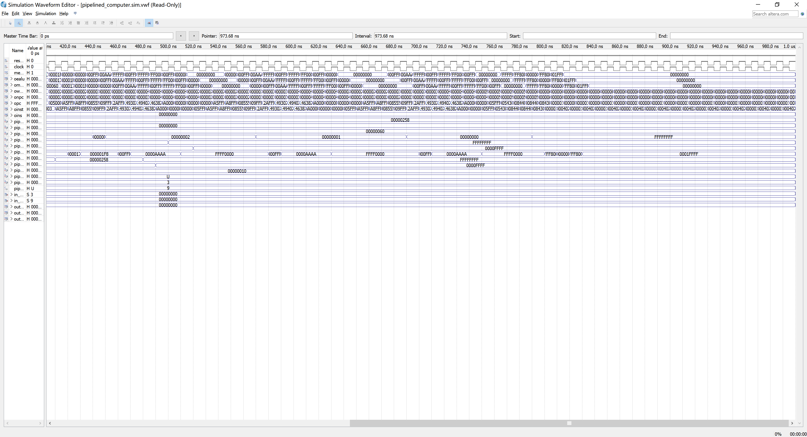
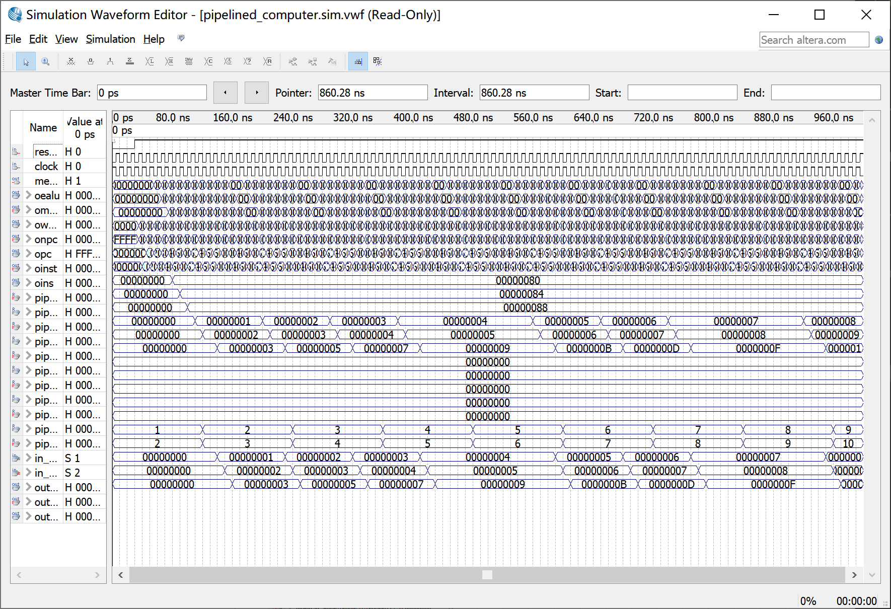
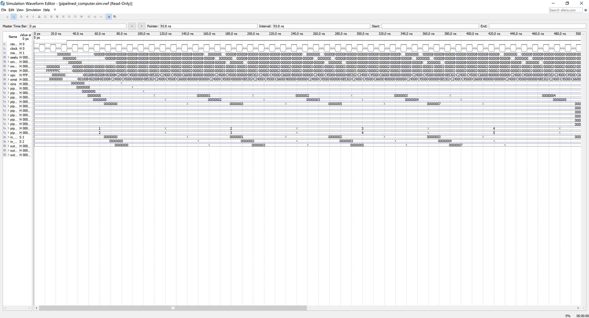
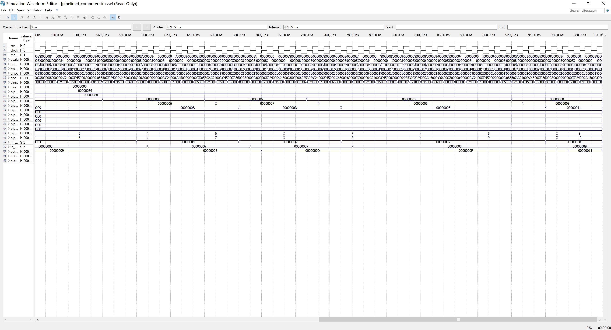

# 五段流水线实验报告

江书洋 519030910043

## 实验目的

1. 理解计算机指令流水线的协调工作原理，初步掌握流水线的设计和实现原理。
2. 深刻理解流水线寄存器在流水线实现中所起的重要作用。
3. 理解和掌握流水段的划分、设计原理及其实现方法原理。
4. 掌握运算器、寄存器堆、存储器、控制器在流水工作方式下，有别于实验一的设计
和实现方法。
5. 掌握流水方式下，通过 I/O 端口与外部设备进行信息交互的方法。 

## 实验平台、仪器
Quartus Ⅱ 13.0, verilog HDL

## 实验任务及实现

按照主文件中的各个模块分别设计即可。具体可以分为以下这些模块：

### pipepc.v

这个阶段根据npc的值更新pc的值。npc即为 “next pc”，是由一个多选器得到的。如果有复位信号，那么pc会置为-4，因为下一次pc+4以后刚好变成0，符合复位的含义。代码如下： 

```verilog
module pipepc(
	input [31: 0]npc,
	input wpcir, 
	input clock,
	input resetn,
	output reg [31: 0] pc
);

	always @ (posedge clock or negedge resetn)
	if (resetn == 0)
		pc <= -4; // 接下来pc会加4
	else
		if (wpcir != 0) // 如果流水线阻塞，那么pc维持原值
			pc <= npc;
endmodule
```

### pipeif.v

这个阶段首先对pc+4，和pipepc中的结果相符。同时，根据ID阶段译码得到的`pcsource`控制信号来选择下一条pc的结果。pcsource中，如果是00那么`npc = pc + 4`；如果是01那么`npc = bpc`，也就是下一条pc的值是beq，bne两条指令跳转的地址；如果是10那么`npc = da`，也就是下一条pc的值是jr指令跳转的寄存器的值；如果是11那么`npc = jpc`，也就是下一条pc的值是j，jal等指令跳转的寄存器的值。代码如下：  
```verilog
module pipeif(
	input [1:0] pcsource,
	input [31: 0] pc,
	input [31: 0] bpc,
	input [31: 0] da, // jr指令对应的寄存器的值
	input [31: 0] jpc,
	output [31: 0] npc,
	output [31: 0] pc4,
	output [31: 0] ins,
	input mem_clock
);
	// npc pc4 ins缺省是wire
	assign pc4 = pc + 4;
	mux4x32 mux1(pc4, bpc, da, jpc, pcsource, npc); // 10->da 11-> jpc
	
	sc_instmem inst(pc, ins, mem_clock);
endmodule
```

### pipeir.v
这个阶段是IF后的IF/ID寄存器。要做的就是将pc和instruction的值锁存进入到ID阶段。同时，如果`wpcir`设置了要stall，那么pc和instruction将要清0。代码如下：  
```verilog
module pipeir(
	input [31: 0] pc4,
	input [31: 0] ins,
	input wpcir,
	input clock,
	input resetn,
	output reg [31: 0] dpc4,
	output reg [31: 0] inst,
	input dbubble
);

always @ (posedge clock or negedge resetn)
begin
	if (resetn == 0)
		begin
			dpc4 <= 0;
			inst <= 0; // 流水线阻塞
		end
	else
		begin
			if (wpcir != 0)
				begin
					dpc4 <= pc4;
					inst <= ins; // 寄存器存储从IF阶段到ID阶段的指令内容和pc内容（pc由pipepc得到）
				end
			if (dbubble)
				begin
					dpc4 <= 0;
					inst <= 0;
				end
		end
			
end
```

### pipeid.v
这个阶段是指令的译码阶段，不仅需要提前判断指令是否有数据冒险，还要判断是否有控制冒险而适当地加入bubble。首先，需要通过旁路与否决定rs和rt寄存器的来源，因此设置了fw_data_a和fw_data_b两个信号来代表那两个寄存器。其次，需要根据立即数信息，对立即数进行符号扩展。根据计算机组成理论课上学到的知识，根据reg_rt寄存器的值判断写入的寄存器是rt还是rd。译码器的具体译码过程我在下一个文件中叙述。除此以外，实验一中的`regfile.v`文件是用于读寄存器的值的，在本次实验中不需要更改，故直接使用。代码如下：  
```verilog
module pipeid(mwreg, mrn, ern, ewreg, em2reg, mm2reg, dpc4, inst, ins,
	wrn, wdi, ealu, malu, mmo, wwreg, mem_clock, resetn,
	bpc, jpc, pcsource, wpcir, dwreg, dm2reg, dwmem, daluc,
	daluimm, da, db, dimm, dsa, drn, dshift, djal,
	drs, drt/*,npc*/, ebubble, dbubble
);
	input wire [4: 0] mrn, ern, wrn;
	input wire mm2reg, em2reg, mwreg, ewreg, wwreg, mem_clock, resetn; 
	// wwreg 写寄存器使能信号
	
	input wire [31: 0]  dpc4, ins, inst, wdi, ealu, malu, mmo; // mmo MEM stage memory output 
	input wire ebubble;
	
	output wire [31: 0] bpc, dimm, jpc, da, db, dsa;// dimm是提前分支中的立即数
	output wire [1:0] pcsource; // 同样是译码信号
	output wpcir, dwreg, dm2reg, dwmem, daluimm, dshift, djal; // 译码阶段sc_cu的译码信号
	// wpcir是 是否stall的标志
	output wire [3: 0] daluc;
	output wire [4: 0] drn, drs, drt;
	output wire dbubble;
	
	wire [31: 0] reada, readb; // 读寄存器得到的值reada readb
	wire [1: 0] fw_data_a, fw_data_b; // forward指示信号
	wire register_eq = (da == db); // 判断是否相等 用来提前beq bne
	wire reg_rt, sext; // register rt 是否使用rt还是rd作为输出寄存器 这个是R和I指令的一个区别标志
	
	
	// 通过选择器得到寄存器输出的值是来自于 读到的寄存器地址，ex阶段的alu输出 mem阶段的alu输出 还是mem阶段的mmo值
	// fw_data_a fw_data_b
	// 00 -- rs=ID/EX
	// 01 -- rs=上一条指令的EX/MEM alu return
	// 10 -- rs=上两条指令的EX/MEM alu return
	// 11 -- rs=MEM/WB的结果
	mux4x32 reada_mux(reada, ealu, malu, mmo, fw_data_a, da);
	mux4x32 readb_mux(readb, ealu, malu, mmo, fw_data_b, db); 
	
	assign drs = inst[25: 21];
	assign drt = inst[20: 16];
	assign dsa = {27'b0, inst[10: 6]}; // 指令中的sa字段 进行32位的扩展
	assign dbubble = (pcsource != 2'b00); // 控制冒险的时候 我默认都产生bubble 也就是不进行分支预测
	
	
	wire splenish = sext & inst[15]; // 判断是否是正数来决定偏移量前面的数是0还是1
	assign dimm = {{16{splenish}}, inst[15: 0]}; // 用来获取立即数字段的值
	assign jpc = {dpc4[31: 28], inst[25: 0], 2'b0};
	wire [31: 0] offset = {{14{splenish}}, inst[15: 0], 2'b0};
	assign bpc = dpc4 + offset;
	mux2x5 muxrn(inst[15: 11], inst[20: 16], reg_rt, drn); // 通过regrt判断写寄存器是rt还是rd regrt 为0是rd
	
	
	// 译码器的输出	
	sc_cu cu(inst[31: 26], inst[5: 0], register_eq, dwmem, dwreg, reg_rt, dm2reg, daluc, dshift, daluimm, pcsource,
				djal, sext, wpcir, inst[25: 21], inst[20: 16], mrn, mm2reg, mwreg, ern, em2reg, ewreg, fw_data_a, fw_data_b, ebubble);
	
	regfile rf(inst[25: 21], inst[20: 16], wdi, wrn, wwreg, mem_clock, resetn, reada, readb);

endmodule
```

### sc_cu.v
这个阶段主要进行指令译码。除了实验一种的内容以外，还新增了旁路机制的两个信号fw_data_a和fw_data_b的设置。如果上一条指令有wreg数据冒险，那么值设置为01，如果上一条的再上一条指令有wreg数据冒险，那么值设置为10，如果上一条指令有m2reg数据冒险，那么值设置为11。其他情况就是00。代码如下：
```verilog
module sc_cu (op, func, register_eq, wmem, wreg, regrt, m2reg, aluc, shift,
              aluimm, pcsource, jal, sext, wpcir, rs, rt, mrn, mm2reg, mwreg, 
				  ern, em2reg, ewreg, fw_data_a, fw_data_b, ebubble);
   input  [5:0] op,func;
   input        register_eq, mwreg, ewreg, mm2reg, em2reg, ebubble; 
	// register_eq 两个寄存器是否相等的零输出信号
	// mwreg ewreg 判断EX 和 MEM 极端的WB控制信号来确定regwrite信号是否有效
	// mm2reg em2reg EX和MEM阶段的lw指令信号（memory to register）
	input [4: 0] rs, rt, mrn, ern; // 本次decode的rs rt寄存器 以及MEM阶段的return和execute阶段的alu return 的寄存器（rt或者是rd）
	
   output       wreg, regrt, jal, m2reg, shift, aluimm, sext, wmem, wpcir;// wmem 写内存信号
   output [3:0] aluc;
   output [1:0] pcsource;
	output reg [1: 0] fw_data_a, fw_data_b; // 4选1选择器的s输入
   wire r_type = ~|op;
   wire i_add = r_type & func[5] & ~func[4] & ~func[3] &
                ~func[2] & ~func[1] & ~func[0];          //100000
   wire i_sub = r_type & func[5] & ~func[4] & ~func[3] &
                ~func[2] &  func[1] & ~func[0];          //100010
      
   //  please complete the deleted code.
   
   wire i_and =r_type & func[5] & ~func[4] & ~func[3] &
                func[2] & ~func[1] & ~func[0];           //100100
   wire i_or  =r_type & func[5] & ~func[4] & ~func[3] &
                func[2] & ~func[1] & func[0];          //100101

   wire i_xor = r_type & func[5] & ~func[4] & ~func[3] &
                func[2] & func[1] & ~func[0];         //100110 
   wire i_sll = r_type & ~func[5] & ~func[4] & ~func[3] &
                ~func[2] & ~func[1] & ~func[0];        //000000
   wire i_srl = r_type & ~func[5] & ~func[4] & ~func[3] &
                ~func[2] & func[1] & ~func[0];       //000010
   wire i_sra = r_type & ~func[5] & ~func[4] & ~func[3] &
                ~func[2] & func[1] & func[0];      //000011
   wire i_jr  = r_type & ~func[5] & ~func[4] & func[3] &
                ~func[2] & ~func[1] & ~func[0];     //001000
	/*wire i_hamming = r_type & func[5] & func[4] & ~func[3] & 
					 ~func[2] & ~func[1] & ~func[0]; // 110000*/
                
   wire i_addi = ~op[5] & ~op[4] &  op[3] & ~op[2] & ~op[1] & ~op[0]; //001000
   wire i_andi = ~op[5] & ~op[4] &  op[3] &  op[2] & ~op[1] & ~op[0]; //001100
   
   wire i_ori  = ~op[5] & ~op[4] &  op[3] &  op[2] & ~op[1] &  op[0]; //001101     
   wire i_xori = ~op[5] & ~op[4] &  op[3] &  op[2] &  op[1] & ~op[0]; //001110
   wire i_lw   =  op[5] & ~op[4] & ~op[3] & ~op[2] &  op[1] &  op[0]; //100011    
   wire i_sw   =  op[5] & ~op[4] &  op[3] & ~op[2] &  op[1] &  op[0]; //101011  
   wire i_beq  = ~op[5] & ~op[4] & ~op[3] &  op[2] & ~op[1] & ~op[0]; //000100
   wire i_bne  = ~op[5] & ~op[4] & ~op[3] &  op[2] & ~op[1] &  op[0]; //000101  
   wire i_lui  = ~op[5] & ~op[4] &  op[3] &  op[2] &  op[1] &  op[0]; //001111  
   wire i_j    = ~op[5] & ~op[4] & ~op[3] & ~op[2] &  op[1] & ~op[0]; //000010  
   wire i_jal  = ~op[5] & ~op[4] & ~op[3] & ~op[2] &  op[1] &  op[0]; //000011  
   assign wpcir = ~(em2reg & (ern == rs | ern == rt)); 
	// ex阶段有没有memory to register的信号（lw） 以及存入的寄存器是否是rs或者rt中的一个
	// 判断lw数据冒险 如果是mm2reg并不受影响
	wire signal_valid = wpcir & (~ebubble); // 信号没有数据冒险 并且 没有bubble（beq bne）
  
   assign pcsource[1] = i_jr | i_j | i_jal;
   assign pcsource[0] = ( i_beq & register_eq ) | (i_bne & ~register_eq) | i_j | i_jal ;
   
   assign wreg = i_add | i_sub | i_and | i_or   | i_xor  |
                 i_sll | i_srl | i_sra | i_addi | i_andi |
                 i_ori | i_xori | i_lw | i_lui  | i_jal;
					 
   assign aluc[3] = wpcir & i_sra ;    // 如果发生了数据冒险 就清空alu 控制信号 设置成0
   assign aluc[2] = wpcir & (i_sub | i_beq | i_bne |
						  i_or  | i_ori |
						  i_lui | i_srl | i_sra);
   assign aluc[1] = wpcir & (i_xor | i_xori |
						  i_lui | i_sll | i_srl | i_sra);
   assign aluc[0] = wpcir & (i_and | i_andi |
						  i_or  | i_ori |
						  i_sll | i_srl | i_sra) ;
   assign shift   = wpcir & (i_sll | i_srl | i_sra );

   assign aluimm  = wpcir & (i_addi | i_andi | i_ori | i_xori | i_lw | i_sw | i_lui);
   assign sext    = wpcir & (i_addi | i_lw | i_sw | i_beq | i_bne);
   assign wmem    = wpcir & i_sw;
   assign m2reg   = wpcir & i_lw;
   assign regrt   = wpcir & (i_addi | i_andi | i_ori | i_xori | i_lw | i_lui);
   assign jal     = wpcir & i_jal;					 
	
	// 设置forwarding
	always @ (*)
	begin
	if ((ern == rs) &(ern != 0) & ewreg & (~em2reg)) // 并不是从memory写到register里的指令，也就是不是lw指令
			fw_data_a = 2'b01;
		else
		// 这个数据冒险的格式是 add $1, $2, $3
		//                   add $4, $5, $6
		//                   add $7, $1, $2 还在write back阶段 没有写回寄存器的时候 用mrn的输出
			if (mwreg & (~mm2reg) & (mrn != 0) & (mrn == rs))
				fw_data_a = 2'b10;  
			else
				if (mwreg & (mrn != 0) & mm2reg & (mrn == rs)) // 中间那个可以换成mm2reg
					fw_data_a = 2'b11; // 这些条件参照书P210
				else
					fw_data_a = 2'b00; // 就是id/ex.rs本身
					
	end
	
	always @ (*)
	begin
	if ((ern == rt) & (ern != 0) & ewreg & (~em2reg))
		fw_data_b = 2'b01;
	else
		if (mwreg & (~mm2reg) & (mrn != 0) & (mrn == rt))
			fw_data_b = 2'b10;
		else
			if (mwreg & (mrn != 0) & mm2reg & (mrn == rt))
				fw_data_b = 2'b11;
			else
				fw_data_b = 2'b00;
	end

endmodule
```

### pipedereg.v
这个阶段就是在复位信号高电平的时候将译码得到的信号锁存，准备送入EX阶段进行计算。代码如下：  
```verilog
module pipedereg(dbubble, drs, drt, dwreg, dm2reg, dwmem,
	daluc, daluimm, da, db, dimm, dsa, drn, dshift, djal,
	dpc4, clock, resetn, ebubble, ers, ert, ewreg, em2reg,
	ewmem, ealuc, ealuimm, ea, eb, eimm, esa, ern0, eshift, ejal, epc4);
						
	input [31: 0] dimm, dpc4, da, db, dsa;
	input dbubble, dwreg, dm2reg, dwmem, djal, dshift, daluimm;
	input [4: 0] drn, drs, drt;
	input [3: 0] daluc;
	input clock, resetn;
	
	output reg [31: 0] esa, eimm, epc4, ea, eb;
	output reg ebubble, ewreg, em2reg, ewmem, ejal, eshift, ealuimm;
	output reg [4: 0] ern0, ers, ert;
	output reg [3: 0] ealuc;


	always @(posedge clock or negedge resetn)
	begin
		if (resetn == 0)
		begin
			ewreg <= 0;
			em2reg <= 0;
			ewmem <= 0;
			ealuimm <= 0;
			eshift <= 0;
			ejal <= 0;
			ea <= 0;
			eb <= 0;
			eimm <= 0;
			epc4 <= 0;
			ern0 <= 0;
			ealuc <= 0;
			ers <= 0;
			ert <= 0;
			esa <= 0;
			ebubble <= 0;
		end
		else
		begin
			ewreg <= dwreg;
			em2reg <= dm2reg;
			ewmem <= dwmem;
			ealuimm <= daluimm;
			eshift <= dshift;
			ejal <= djal;
			ea <= da;
			eb <= db;
			eimm <= dimm;
			epc4 <= dpc4;
			ern0 <= drn;
			ealuc <= daluc;
			ers <= drs;
			ert <= drt;
			esa <= dsa;
			ebubble <= dbubble;
		end
	end
endmodule
```
### pipeexe.v
这个阶段主要进行EX模块的alu计算。要输入`alu.v`中的两个操作数：一个rs，根据选择器选择是rs寄存器中的值还是进行移位运算的sa立即数；另一个rt，根据选择器选择是rt寄存器中的值还是进行立即数运算的立即数。同时根据是否有jal信号来判断最后得到的结果是正常alu运算的结果还是要跳转的地址值。最后通过ealuc信号对两个操作数进行alu计算，结果为r。代码如下：
```verilog
module pipeexe(ealuc, ealuimm, ea, eb, eimm, esa, eshift, ern0,
	epc4, ejal, ern, ealu, ezero, ert, wrn, wdi, malu, wwreg,a,b,r);
	input ealuimm,eshift,ejal;
	input [4:0] ert, esa, ern0 ; 
	input [3:0] ealuc;
	input [31:0] ea,eb,eimm,epc4;
	input [4:0] wrn;
	input [31:0] wdi;
	input [31:0] malu;
	input wwreg;
	
	output [31:0] ealu;
	output [4:0] ern;
	output ezero;
	
	output wire [31:0] a,b,r;
	assign ern = ern0 | {5{ejal}};
	
	mux2x32 a_mux(ea, esa, eshift, a);
	mux2x32 b_mux(eb, eimm, ealuimm, b);
	
	mux2x32 ealumux(r, epc4, ejal, ealu);
	alu alu_module(a, b, ealuc, r, ezero);

endmodule
```

### pipeemreg.v
这个阶段和前述的寄存器阶段类似，也是在复位信号高电平的时候锁存响应的信号。代码如下：
```verilog
module pipeemreg(ewreg, em2reg,ewmem,ealu,eb,ern,ezero,clock,resetn,mwreg,
	mm2reg,mwmem,malu,mb,mrn,mzero);
	
	input wire ewreg, em2reg, ewmem;
	input wire [31:0] ealu, eb;
	input wire [4:0] ern;
	input wire clock, resetn, ezero;
	
	output reg mwreg, mm2reg, mwmem;
	output reg [31:0] malu, mb;
	output reg [4:0] mrn;
	output reg mzero;
	
	always @ (posedge clock or negedge resetn)
	begin
		if (resetn == 0)
		begin
			mwreg <= 0;
			mm2reg <= 0;
			mwmem <= 0;
			malu <= 0;
			mb <= 0;
			mrn <= 0;
			mzero <= 0;
			
		end
		else
		begin
			mwreg <= ewreg;
			mm2reg <= em2reg;
			mwmem <= ewmem;
			malu <= ealu;
			mb <= eb;
			mrn <= ern;
			mzero <= ezero;
		end
	end

endmodule
```

### pipemem.v
这个阶段主要是修改`sc_datamem`这个模块，而sc_datamem模块也主要是将addr换成malu（变量名的不同），大体的结构和功能保持不变，因此直接将实验二的代码复制进来修改即可。因此这个文件所涉及的改动较少。代码如下：
```verilog
module pipemem(mwmem, malu, mb, clock, mem_clock, mmo,
	real_in_port0, real_in_port1, real_out_port0, real_out_port1,
	real_out_port2, real_out_port3);
	input wire mwmem, clock,mem_clock;
	input wire [31:0] malu, mb, real_in_port0, real_in_port1;

	output wire [31:0] mmo, real_out_port0, real_out_port1, real_out_port2, real_out_port3;
	
	sc_datamem dmem(malu, mb, mmo, mwmem, mem_clock, real_in_port0, real_in_port1, real_out_port0, real_out_port1, real_out_port2, real_out_port3);
endmodule
```

### pipemwreg.v
寄存器模块的功能不再赘述。代码如下：
```verilog
module pipemwreg(mwreg, mm2reg, mmo, malu, mrn, clock, resetn,
	wwreg, wm2reg, wmo, walu, wrn);
	input mwreg, mm2reg, clock, resetn;
	input [31: 0] malu, mmo;
	input [4: 0] mrn;
	output reg wwreg, wm2reg;
	output reg [4: 0] wrn;
	output reg [31: 0] wmo, walu;
	
	always @ (posedge clock or negedge resetn)
	begin
	if (resetn == 0)
		begin
			wwreg <= 0;
			wm2reg <= 0;
			wrn <= 0;
			wmo <= 0;
			walu <= 0;
		
		end
	else
		begin
			wwreg <= mwreg;
			wm2reg <= mm2reg;
			wrn <= mrn;
			wmo <= mmo;
			walu <= malu;
		end
	end
endmodule
```

### pipelined_computer.v
最后给出Top-level文件。仅仅做了些许改动。代码如下：  
```verilog
module pipelined_computer (resetn, clock, mem_clock, opc, oinst, oins, oealu, omalu, owalu,
onpc, in_port0, in_port1, out_port0, out_port1, out_port2, out_port3);
//定义顶层模块 pipelined_computer，作为工程文件的顶层入口，如图 1-1 建立工程时指定。
	input resetn, clock;
	output mem_clock;
	assign mem_clock = ~clock;
	//定义整个计算机 module 和外界交互的输入信号 包括复位信号 resetn、时钟信号 clock、
	//以及一个和 clock 同频率但反相的 mem_clock 信号。 mem_clock 用于指令同步 ROM 和数据同步 RAM 使用，其波形需要有别于实验一。
	//这些信 号 可 以 用 作 仿 真验 证时 的 输 出 观 察 信 号 。
	input [5:0] in_port0, in_port1;
	output [31:0] out_port0, out_port1, out_port2, out_port3; /*output [6:0] out_port0,out_port1,out_port2,out_port3;*/
	
	wire [31:0] real_out_port0,real_out_port1,real_out_port2,real_out_port3;
	wire [31:0] real_in_port0 = {26'b00000000000000000000000000,in_port0};
	wire [31:0] real_in_port1 = {26'b00000000000000000000000000,in_port1};
	assign out_port0 = real_out_port0[31:0];//assign out_port0 = real_out_port0[6:0];
	assign out_port1 = real_out_port1[31:0];//assign out_port0 = real_out_port1[6:0];
	assign out_port2 = real_out_port2[31:0];//assign out_port0 = real_out_port2[6:0];
	assign out_port3 = real_out_port3[31:0];//assign out_port0 = real_out_port3[6:0];
	//IO 口 的定义，宽度可根据自己设计选择。
	wire [31:0] pc,ealu,malu,walu;
	output [31:0] opc,oealu,omalu,owalu; // for watch
	assign opc = pc;
	assign oealu = ealu;
	assign omalu = malu ;
	assign owalu = walu ;
	output [31:0] onpc,oins,oinst; // for watch
	assign onpc=npc;
	assign oins=ins;
	assign oinst=inst;
	//模块用于仿真输出的观察信号。缺省为 wire 型。为了便于观察内部关键信号将其接到输出管脚。不输出也一样，只是仿真时候要从内部信号里去寻找。
	wire [31:0] bpc,jpc,pc4,npc,ins,inst;
	//模块间互联传递数据或控制信息的信号线 ,均为 32 位宽信号。 IF 取指令阶段。
	//bpc 分支指令跳转地址
	//jpc 跳转指令地址
	//npc 下一条指令地址
	//pc4 PC+4
	wire [31:0] dpc4,da,db,dimm,dsa;
	//模块间互联传递数据或控制信息的信号线 ,均为 32 位宽信号。 ID 指令译码阶段。
	wire [31:0] epc4,ea,eb,eimm,esa;
	//模块间互联传递数据或控制信息的信号线 ,均为 32 位宽信号。 EXE 指令运算阶段。
	wire [31:0] mb,mmo;
	//模块间互联传递数据或控制信息的信号线 ,均为 32 位宽信号。 MEM 访问数据阶段。
	wire [31:0] wmo,wdi;
	//模块间互联传递数据或控制信息的信号线 ,均为 32 位宽信号。 WB 回写寄存器阶段。
	wire [4:0] ern0,ern,drn,mrn,wrn;
	//模块间互联通过流水线寄存器传递结果寄存器号的信号线,寄存器号(32个)为5bit。
	wire [4:0] drs,drt,ers,ert;
	// 模块间互联通过流水线寄存器传递rs、rt寄存器号的信号线,寄存器号(32个)为5bit。
	wire [3:0] daluc,ealuc;
	//ID 阶段向 EXE 阶段通过流水线寄存器传递的 aluc 控制信号，4bit。
	wire [1:0] pcsource;
	//CU 模块向 IF 阶段模块传递的 PC 选择信号，2bit。
	wire wpcir;
	// CU 模块发出的控制流水线停顿的控制信号，使 PC 和 IF/ID 流水线寄存器保持不变。
	wire dwreg,dm2reg,dwmem,daluimm,dshift,djal; //id stage
	// ID 阶段产生，需往后续流水级传播的信号。
	wire ewreg,em2reg,ewmem,ealuimm,eshift,ejal; //exe stage
	//来自于 ID/EXE 流水线寄存器， EXE 阶段使用，或需要往后续流水级传播的信号。
	wire mwreg,mm2reg,mwmem; //mem stage
	//来自于 EXE/MEM 流水线寄存器， MEM 阶段使用，或需要往后续流水级传播的信号。
	wire wwreg,wm2reg; //wb stage
	//来自于 MEM/WB 流水线寄存器， WB 阶段使用的信号。
	wire ezero,mzero;
	//模块间互联通过流水线寄存器传递的zero信号线
	wire ebubble,dbubble;
	//模块间互联通过流水线寄存器传递的流水线冒险处理bubble控制信号线
	pipepc prog_cnt(npc,wpcir,clock,resetn,pc);
	//程序计数器模块，是最前面一级 IF 流水段的输入。
	pipeif if_stage(pcsource,pc,bpc,da,jpc,npc,pc4,ins,mem_clock); // IF stage
	//IF 取指令模块 注意其中包含的指令同步 ROM 存储器的同步信号
	//即输入给该模块的 mem_clock 信号 模块内定义为 rom_clk。 // 注意 mem_clock。
	//实验中可采用系统 clock 的反相信号作为 mem_clock（亦即 rom_clock））,
	//即留给信号半个节拍的传输时间。
	//ins 是在clock下降的时候取得的
	pipeir inst_reg(pc4,ins,wpcir,clock,resetn,dpc4,inst,dbubble); // IF/ID 流水线寄存器
	//IF/ID 流水线寄存器模块，起承接 IF 阶段和 ID 阶段的流水任务。
	//在 clock 上升沿时，将 IF 阶段需传递给 ID 阶段的信息，锁存在 IF/ID 流水线寄存器
	//中，并呈现在 ID 阶段。
	pipeid id_stage(mwreg,mrn,ern,ewreg,em2reg,mm2reg,dpc4,inst,ins,
	wrn,wdi,ealu,malu,mmo,wwreg,mem_clock,resetn,
	bpc,jpc,pcsource,wpcir,dwreg,dm2reg,dwmem,daluc,
	daluimm,da,db,dimm,dsa,drn,dshift,djal,
	drs,drt/*,npc*/,ebubble,dbubble); // ID stage
	//ID 指令译码模块。注意其中包含控制器 CU、寄存器堆、及多个多路器等。
	//其中的寄存器堆，会在系统 clock 的下沿进行寄存器写入，也就是给信号从 WB 阶段
	//传输过来留有半个 clock 的延迟时间，亦即确保信号稳定。
	//该阶段 CU 产生的、要传播到流水线后级的信号较多。
	pipedereg de_reg(dbubble, drs, drt, dwreg, dm2reg, dwmem,
	daluc, daluimm, da, db, dimm, dsa, drn, dshift, djal,
	dpc4, clock, resetn, ebubble, ers, ert, ewreg, em2reg,
	ewmem, ealuc, ealuimm, ea, eb, eimm, esa, ern0, eshift, ejal, epc4);
	// ID/EXE 流水线寄存器
	//ID/EXE 流水线寄存器模块，起承接 ID 阶段和 EXE 阶段的流水任务。
	//在 clock 上升沿时，将 ID 阶段需传递给 EXE 阶段的信息，锁存在 ID/EXE 流水线
	//寄存器中，并呈现在 EXE 阶段。
	pipeexe exe_stage ( ealuc, ealuimm, ea, eb, eimm, esa, eshift, ern0,
	epc4, ejal, ern, ealu, ezero, ert, wrn, wdi, malu, wwreg,a,b,r); // EXE stage
	//EXE 运算模块。其中包含 ALU 及多个多路器等。
	pipeemreg em_reg(ewreg, em2reg,ewmem,ealu,eb,ern,ezero,clock,resetn,mwreg,
	mm2reg,mwmem,malu,mb,mrn,mzero);       // EXE/MEM 流水线寄存器
	//EXE/MEM 流水线寄存器模块，起承接 EXE 阶段和 MEM 阶段的流水任务。
	//在 clock 上升沿时，将 EXE 阶段需传递给 MEM 阶段的信息，锁存在 EXE/MEM
	//流水线寄存器中，并呈现在 MEM 阶段。
	pipemem mem_stage (mwmem,malu,mb,clock,mem_clock,mmo,
	real_in_port0,real_in_port1,real_out_port0,real_out_port1,
	real_out_port2,real_out_port3);   // MEM stage
	//MEM 数据存取模块。其中包含对数据同步 RAM 的读写访问。 // 注意 mem_clock。
	//输入给 该同步 RAM 的 mem_clock 信号，模块内定义为 ram_clk。
	//实验中可采用系统 clock 的反相信号作为 mem_clock 信号（亦即 ram_clk））,
	//即留给信号半个节拍的传输时间，然后在 mem_clock 上沿时，读输出、或写输入。
	pipemwreg mw_reg(mwreg,mm2reg,mmo,malu,mrn,clock,resetn,
	wwreg,wm2reg,wmo,walu,wrn); // MEM/WB 流水线寄存器
	//MEM/WB 流水线寄存器模块 起承接 MEM 阶段和 WB 阶段的流水任务。
	//在 clock 上升沿时 将 MEM 阶段需传递给 WB 阶段的信息 锁存在 MEM/WB
	//流水线寄存器中，并呈现在 WB 阶段。
	mux2x32 wb_stage(walu,wmo,wm2reg,wdi); // WB stage
	//WB 写回阶段模块。事实上，从设计原理图上可以看出，该阶段的逻辑功能部件只
	//包含一个多路器，所以可以仅用一个多路器的实例即可实现该部分。
	//当然，如果专门写一个完整的模块也是很好的。
endmodule
```

## 实验结果

通过修改`Ipm_ram_dq_dram.v`和`Ipm_rom_irom.v`两个文件中读取的mif文件来对不同的mips指令进行仿真。不同指令的波形图分别如下所示
### 本次实验波形图仿真
完整图如下：

细节图如下：
 


### 实验一波形图仿真
仿真前，修改了MIPS指令，加入了bubble使得仿真能够正确进行。MIPS指令如下：
```MIPS
main:   lui $1, 0                 # address of data[0] %
        ori $4, $1, 80            # address of data[0] %
        addi $5, $0, 4            # counter %
 call:  jal sum                   # call function %
        sw $2, 0($4)              # store result %
        lw $9, 0($4)              # check sw %
        sub $8, $9, $4            # sub: $8 <- $9 - $4 %
        addi $5, $0, 3            # counter %
loop2:  addi $5, $5, -1           # counter - 1 %
        ori $8, $5, 0xffff        # zero-extend: 0000ffff %
        xori $8, $8, 0x5555       # zero-extend: 0000aaaa %
        addi $9, $0, -1           # sign-extend: ffffffff %
        andi $10, $9, 0xffff      # zero-extend: 0000ffff %
        or $6, $10, $9            # or: ffffffff %
        xor $8, $10, $9           # xor: ffff0000 %
        and $7, $10, $6           # and: 0000ffff %
        beq $5, $0, shift         # if $5 = 0, goto shift %
        sll $0, $0, 0             # nop %
        j loop2                   # jump loop2 %
 shift: addi $5, $0, -1           # $5 = ffffffff %
        sll $8, $5, 15            # <<15 = ffff8000 %
        sll $8, $8, 16            # <<16 = 80000000 %
        sra $8, $8, 16            # >>16 = ffff8000 (arith) %
        srl $8, $8, 15            # >>15 = 0001ffff (logic) %
 finish:j finish                  # dead loop %
 sum:   add $8, $0, $0            # sum %
 loop:  lw $9, 0($4)              # load data %
        addi $4, $4, 4            # address + 4 %
        add $8, $8, $9            # sum %
        addi $5, $5, -1           # counter - 1 %
        bne $5, $0, loop          # finish? %
        sll $2, $8, 0             # move result to $v0 %
        jr $ra                    # return %
```
通过`se.exe`软件得到mif指令码，得到仿真波形。完整波形如下：

细节波形如下：



### 实验二波形展示
完整波形展示：

细节图展示：



## FPGA 硬件资源占用情况
以普遍理性而论，流水线CPU需要更多的硬件冒险资源和流水线寄存器资源，因此在硬件的占用率上流水线CPU比单周期CPU更高。这一点也可以用内存占用率来证明。

## 板级验证

这部分因为要加上IO端口，因此代码有些许细微的改动。具体的代码可以见代码文件夹。
### 加法验证
和实验二一样，我使用SW5-SW9作为HEX0和HEX1的按键输入，使用SW0-SW4作为HEX3和HEX2的按键输入，将输出结果绑定到HEX5和HEX4上。同时和实验二不同的是，我没有用到HEX7和HEX6的数码管，因此我让它们全灭。最后得到的图如下所示：  


### 减法验证
我用上了加法验证中灭掉的管脚。如果两个寄存器相减的值小于零，就在最左边的数码管上加上一个负号代表结果。最后得到的图如下所示：


## 实验总结
本次实验耗时较长，并且由于对流水线内容的不熟悉，导致很多代码都要慢慢想。最后板级验证也没有做的很好，仍留下了可以完善的空间。最后做个总结的话，就是我逐渐掌握了Quartus Ⅱ13.0的用法和硬件设计的基本思路，对于流水线的bubble和数据冒险控制冒险等内容有了较深的体会。